<div align="center">

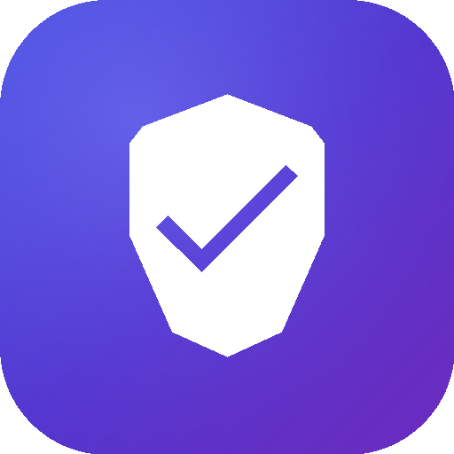

# VTScan

### A beautiful, modern VirusTotal client for Android

**Scan files, URLs and installed apps against 70+ antivirus engines — wrapped in a Material 3 Expressive UI.**

<br/>

[](https://developer.android.com)
[](https://kotlinlang.org)
[](https://developer.android.com/jetpack/compose)
[](https://m3.material.io)
[](https://developer.android.com/tools/releases/platforms)
<br/>
[](https://github.com/ProfessorQuantumUniverse/VTScan/releases/latest)
[](https://github.com/ProfessorQuantumUniverse/VTScan/releases)
[](https://github.com/ProfessorQuantumUniverse/VTScan/stargazers)
[](https://github.com/ProfessorQuantumUniverse/VTScan/commits)

<br/>

### ⬇️ Download

<a href="https://github.com/ProfessorQuantumUniverse/VTScan/releases/latest">
  
</a>
&nbsp;
<a href="https://github.com/ProfessorQuantumUniverse/VTScan/issues">
  
</a>

<br/><br/>

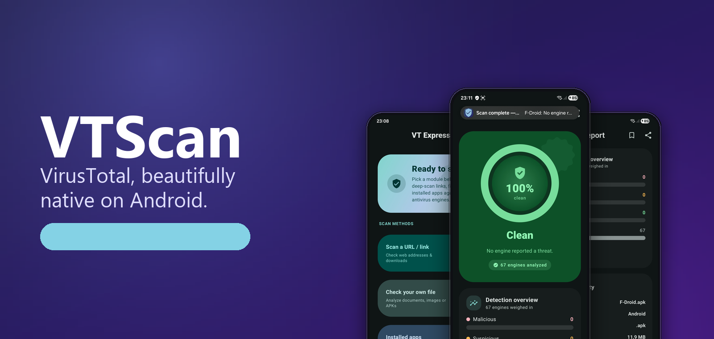

</div>

---

## ✨ What is VTScan?

VTScan is a native Android app that puts the full power of the [VirusTotal](https://www.virustotal.com) API in your pocket. Submit a **file**, a **URL**, or one of your **installed apps**, watch the analysis happen in real time, and explore a richly detailed threat report — from the verdict gauge down to individual engine detections, sandbox behavior, certificates, and APK internals.

It's built to be **fast**, **resilient**, and genuinely **nice to look at**, with a hand-tuned "Material 3 Expressive" layer on top of Material You.

---

## 📱 Screenshots

<div align="center">

<table>
  <tr>
    <td>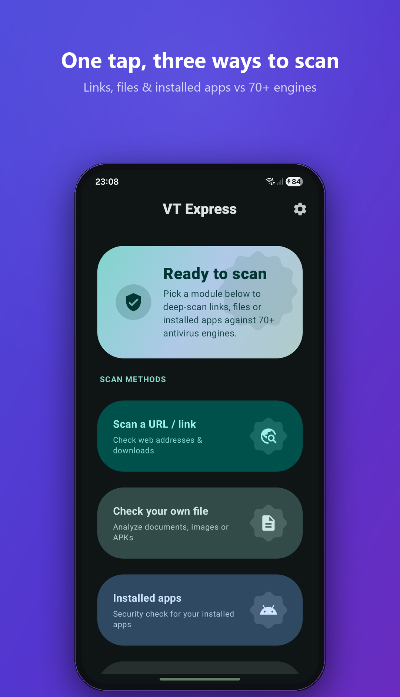</td>
    <td>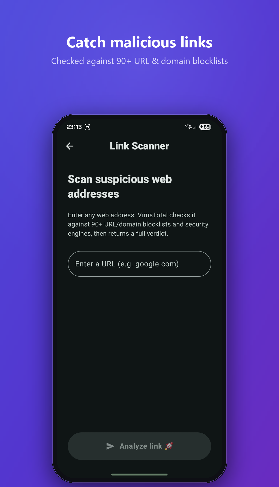</td>
    <td>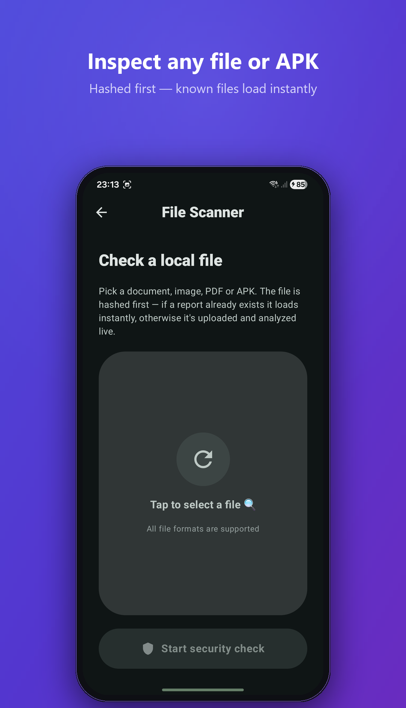</td>
    <td>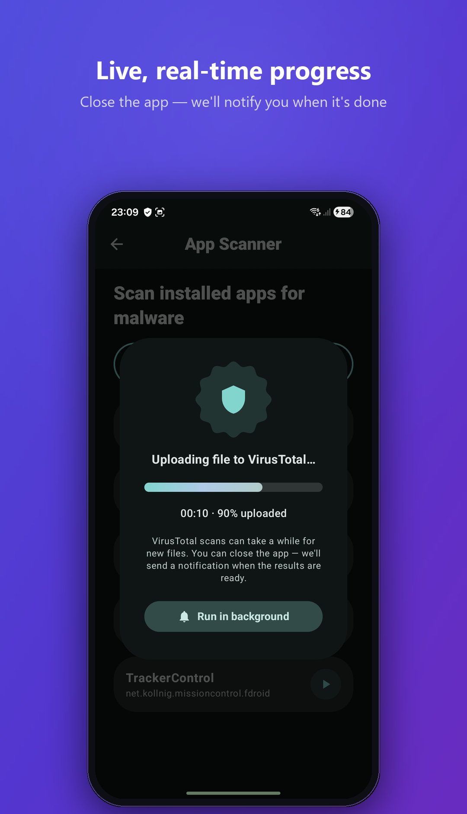</td>
  </tr>
  <tr>
    <td>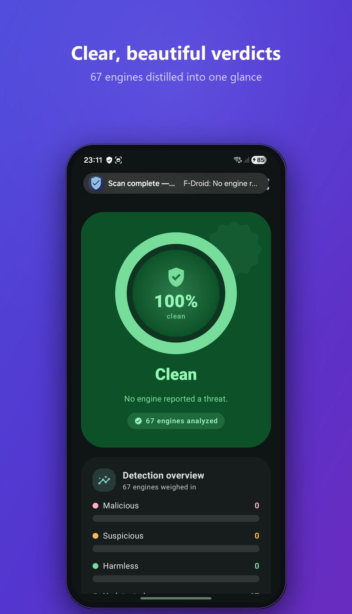</td>
    <td>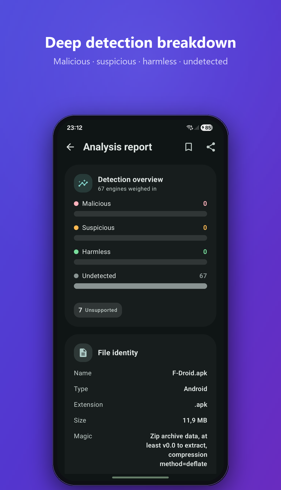</td>
    <td>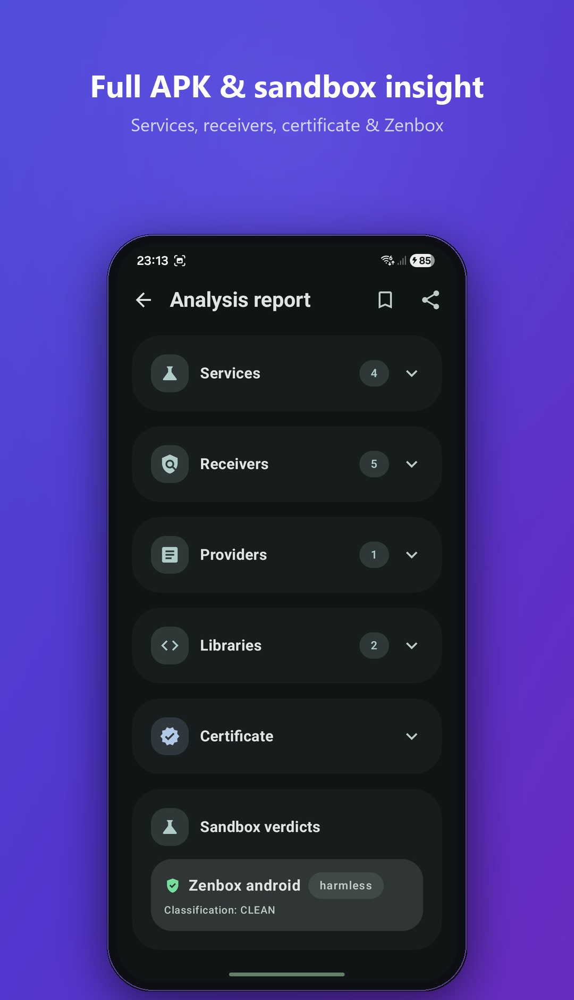</td>
    <td>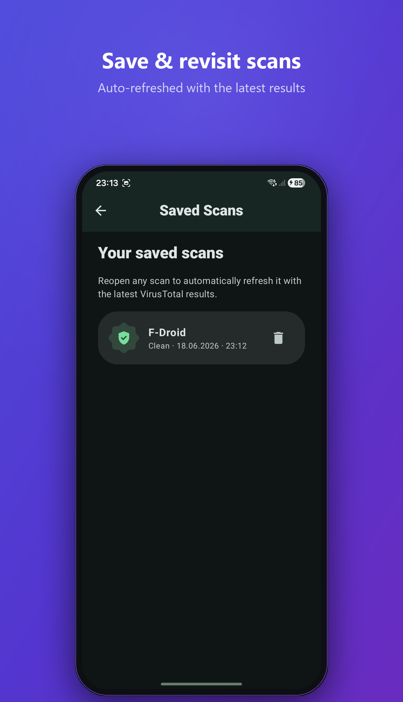</td>
  </tr>
</table>

</div>

---

## 🚀 Features

| | |
|---|---|
| 🔗 **URL scanning** | Check any web address against 90+ URL/domain blocklists with a full submit → poll → fetch flow. |
| 🗂️ **File scanning** | Upload any document, image, PDF or APK with real, byte-level progress. Hashed first — known files load instantly. |
| 📦 **Installed-app scanner** | Search your installed apps and scan their APKs for malware in one tap. |
| 📊 **Rich reports** | Verdict gauge, detection bars, threat classification, hashes, history & votes, sandbox verdicts, YARA, certificate & APK internals, and raw JSON blocks. |
| 🔭 **Background scanning** | Scans run in a foreground service and survive leaving the app — get a notification the moment results are ready. |
| 🔖 **Saved scans** | Bookmark reports and re-open them later (works offline); auto-refreshed with the latest results on reopen. |
| 🎨 **Material You** | Dynamic color theming, custom scalloped "cookie" badges, aurora gradients, and expressive motion. |
| 🌗 **Light & dark** | Full hand-built tonal schemes for both, plus a themed (monochrome) launcher icon. |
| 📳 **Haptics & motion** | Distinct success/error haptics, spring press-feedback, and smooth fade-through navigation. |

---

## 🧱 Architecture

VTScan follows a clean, layered architecture (UI → Domain → Data) with Hilt-powered dependency injection. A single app-scoped `ScanManager` is the source of truth for scan state, so the UI stays in sync whether the app is foregrounded, backgrounded, or destroyed.

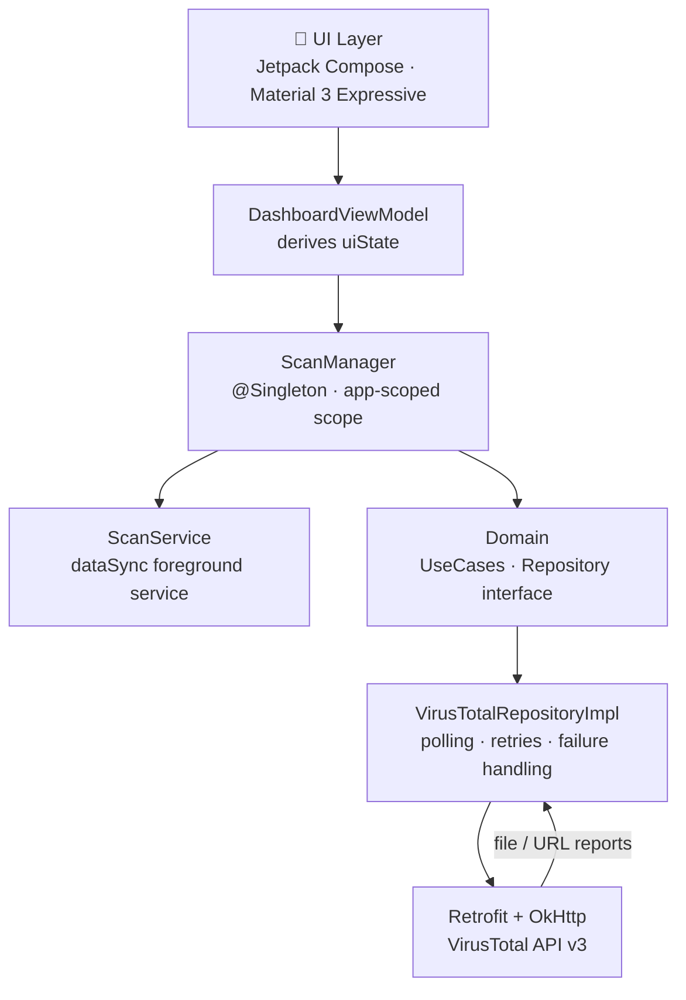

**Highlights**
- **Resilient polling** — `/analyses/{id}` is polled with a 6-minute wall-clock cap (429 → keep waiting), then the report is re-fetched until results are populated, returning a *clear* failure instead of an empty "No verdict" report.
- **Background-safe** — `ScanState` (Idle / Running / Success / Error) lives in `ScanManager` and survives Activity destruction; `ScanService` keeps the process alive and posts the ongoing + "results ready" notifications.
- **Defensive parsing** — nearly every `/files` field is captured; ambiguous shapes use `JsonObject`/`JsonElement` and the parser runs with `ignoreUnknownKeys + coerceInputValues + isLenient`, so an unexpected payload can't crash a report.

---

## 🛠️ Tech Stack

- **Language:** Kotlin (100%)
- **UI:** Jetpack Compose · Material 3 (+ `material-icons-extended`) · custom expressive theming layer
- **DI:** Hilt
- **Networking:** Retrofit · OkHttp · `kotlinx.serialization`
- **Async:** Kotlin Coroutines
- **Persistence:** DataStore (saved scans)
- **Min / Target SDK:** 30 / 36 · **JDK:** 17

---

## 🏁 Getting Started

### Prerequisites
- Android Studio (latest stable)
- JDK 17
- A free [VirusTotal API key](https://www.virustotal.com/gui/my-apikey)

### Build & run

```bash
git clone https://github.com/ProfessorQuantumUniverse/VTScan.git
cd VTScan
./gradlew :app:assembleDebug
```

Or open the project in Android Studio and hit ▶️ **Run**.

### Add your API key
On first launch the **intro screen** asks for your VirusTotal API key — paste it in and you're ready to scan. The key is stored locally on-device. The free key allows up to 4 lookups per minute.

---

## 📂 Project Structure

```
app/src/main/java/com/quantum_prof/vtscansuite/
├── data/          # models, remote API, repository implementation
├── domain/        # repository interface + use cases
├── di/            # Hilt modules (NetworkModule, …)
├── scan/          # ScanManager, ScanService, notifications
└── ui/
    ├── intro/      # animated splash + API-key entry
    ├── dashboard/  # home, link/file/app scanners, scanning overlay
    ├── results/    # full report rendering
    ├── components/ # reusable expressive components
    ├── theme/      # color, shapes, typography, motion
    └── util/       # haptics, interactions, linking
```

> Marketing assets in `docs/` are generated by [`docs/build_assets.py`](docs/build_assets.py) (logo, banner & mockups) from the raw screenshots in `docs/screenshots/`.

---

## 🤝 Contributing

Issues and pull requests are welcome! If you find a bug or have an idea, open an issue to start the conversation.

---

## 📜 License

No license has been chosen yet, so default copyright applies. If you'd like others to reuse the code, consider adding one (e.g. [MIT](https://choosealicense.com/licenses/mit/)) via GitHub's _Add file → Create new file → `LICENSE`_ flow.

---

<div align="center">

Made with 💜 and Jetpack Compose · Powered by the [VirusTotal API](https://developers.virustotal.com)

</div>
