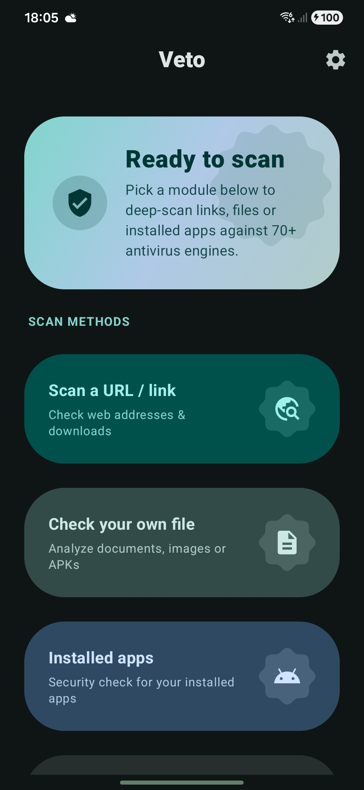
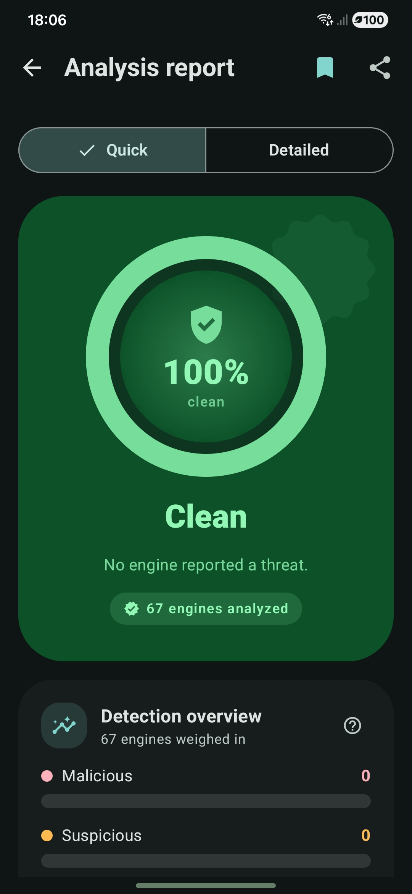
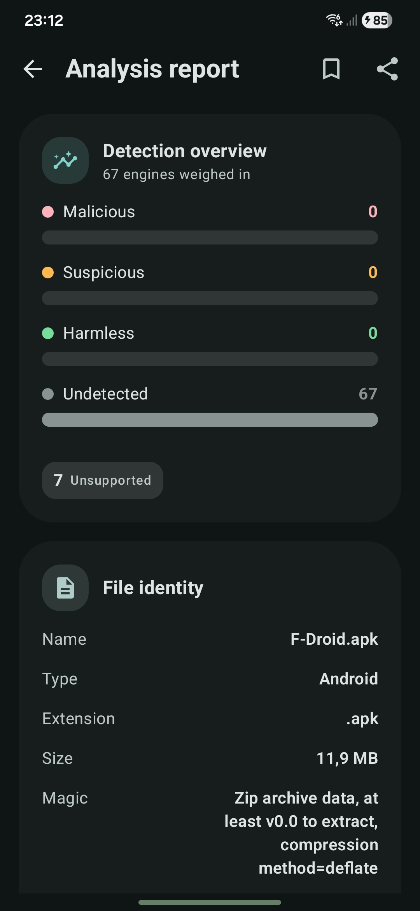
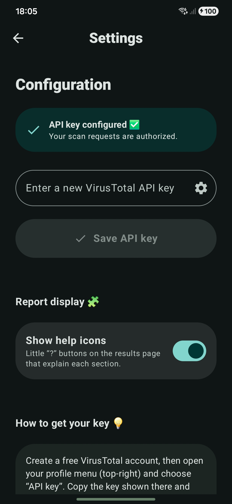
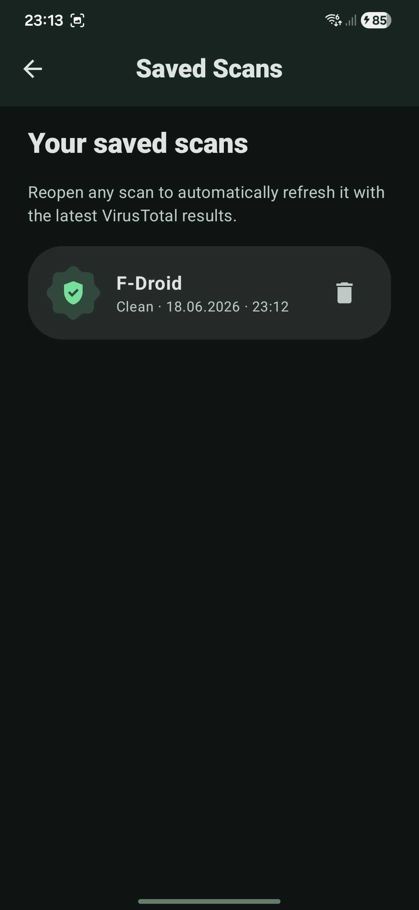

<div align="center">


# Veto

### An open source VirusTotal client for Android

Free and open source. Bring your own VirusTotal API key to scan files, links, and installed applications against over 70 engines, built with a Material 3 interface. No accounts, no tracking, no ads.

[](https://developer.android.com)
[](https://kotlinlang.org)
[](https://developer.android.com/jetpack/compose)
[](https://developer.android.com/tools/releases/platforms)

</div>

## What is Veto?

Veto is an Android client for VirusTotal. Submit a file, a link, or an installed application to view real-time analysis results. The application displays a clear report ranging from a single unified verdict to the complete set of fields returned by the service.

The project is free and open source, containing no user accounts, tracking systems, or advertising. Because users supply their own VirusTotal API key, all scans run directly under their personal account without being routed through intermediate third-party servers.

---

## Screenshots

<div align="center">
<table>
  <tr>
    <td></td>
    <td></td>
    <td></td>
  </tr>
</table>
<table>
  <tr>
    <td></td>
    <td></td>
  </tr>
</table>
</div>

---

## Feature Set

* **Scan Capability:** Scan installed apps, local files, or target URLs.
* **Multi-Engine Aggregation:** Combines diagnostics from over 70 antivirus engines.
* **Dual Reporting Modes:** Quick mode for rapid verification summaries, and Detailed mode for deep inspection.
* **Contextual Explanations:** Explanatory text is available for every section, with a setting to hide explanations if desired.
* **High-Fidelity Reports:** Displays file hashes, threat classifications, history, community votes, sandbox behaviors, YARA matches, Android application internals, and all additional API payload fields.
* **Background Execution:** Real-time upload and analysis progress tracking that persists inside a background service.
* **Offline Access:** Saves reports locally to allow review at a later time, even without an internet connection.
* **Rate Limit Warnings:** Displays clear notifications when the local API key reaches its rate limit.
* **Theming:** Full Material 3 support with dynamic system colors, supporting both light and dark themes.

---

### Core Architecture Implementation Details

* **State Synchronization:** The application scoped `ScanManager` serves as the centralized source of truth for all scanning states. This ensures that the user interface remains synchronized whether the app is active in the foreground, suspended in the background, or destroyed by the operating system.
* **Resilient Polling:** The app polls the `/analyses/{id}` endpoint using a six-minute wall clock cap. If a rate limit response is encountered, the process waits rather than failing. The report is re-fetched until the results are populated, returning a structured failure state if the timeout limit is reached.
* **Process Lifecycle:** While the `ScanState` resides within the `ScanManager` to survive Activity destruction, `ScanService` maintains the process lifecycle during active operations and manages ongoing and completion notifications.
* **Full Fidelity Parsing:** Common fields are captured using typed models, while the complete raw `attributes` JSON is retained via a custom serializer. This allows the Detailed report view to render all returned fields, including any new fields added to the API payload over time.

---

## Tech Stack

| Layer | Technology | Role in Project |
| :--- | :--- | :--- |
| **Language** | Kotlin | Primary programming language |
| **UI Framework** | Jetpack Compose | Declarative UI structure |
| **Design System** | Material 3 | Visual styling, dynamic systems coloring, and extended icons |
| **Dependency Injection** | Hilt | Dependency management |
| **Networking** | Retrofit & OkHttp | HTTP communication with the VirusTotal API |
| **Serialization** | `kotlinx.serialization` | Type-safe JSON parsing and custom attribute preservation |
| **Asynchrony** | Kotlin Coroutines | Asynchronous programming and background processing |
| **Persistence** | Jetpack DataStore | Dynamic settings storage and saved scan reports |
| **Compatibility** | SDK 30 to 36 | Compiled with JDK 17, minSdk 30, targetSdk 36 |

---

## Project Structure

```
└── app/src/main/java/com/quantum_prof/vtscansuite/
    ├── data/          # Models, remote API, and repository implementation
    ├── domain/        # Repository interface and business use cases
    ├── di/            # Hilt dependency injection modules
    ├── scan/          # ScanManager, ScanService, and system notifications
    └── ui/            # UI components and presentation layers
        ├── intro/     # Splash screen and API key configuration
        ├── dashboard/ # Navigation hub: link, file, and app scanning modules
        ├── results/   # Quick and Detailed report visualizers
        ├── components/# Reusable UI elements and layouts
        ├── theme/     # Color, shapes, typography, and motion configurations
        └── util/      # Haptic feedback, gestures, and deep linking utilities
```

* Store listing assets and text resources are available in `fastlane/metadata/android/en-US/`.
* Editable mockup SVGs are located in `docs/store/svg/`.
* Mockups can be exported to PNG format using `docs/store/export.html`.

---

## Getting Started

### Prerequisites
* Android Studio (latest stable version)
* JDK 17
* A free VirusTotal API key, which can be acquired at: https://www.virustotal.com/gui/my-apikey

### Build and Run

Clone the repository and compile the debug build using the command line:

```bash
git clone https://github.com/ProfessorQuantumUniverse/VTScan.git
cd VTScan
./gradlew :app:assembleDebug
```

Alternatively, open the root directory inside Android Studio and select the Run configuration.

On the initial launch, enter your VirusTotal API key in the introduction setup screen. The key is stored locally on your device. Free API keys are typically subject to a limit of four lookups per minute.

---

## Privacy Policy

The application communicates exclusively with the VirusTotal API using the credentials you provide. Uploaded files, submitted URLs, and dynamic results are sent directly to VirusTotal's servers. The API key is stored locally on your device. Veto does not collect analytics data and contains no advertising SDKs.

---

## License

This project is licensed under the terms of the **GNU General Public License v3.0**.

### Key Terms of GPLv3:
* **Commercial use:** Permitted
* **Modification:** Permitted
* **Distribution:** Permitted
* **Source code disclosure:** Required upon distribution
* **Same license:** Modified code must also use GPLv3
* **Liability & Warranty:** None provided by authors

For more details, please see the [LICENSE](LICENSE) file in this repository.

---

<div align="center">
Powered by the VirusTotal API. Not affiliated with or endorsed by VirusTotal.
</div>
