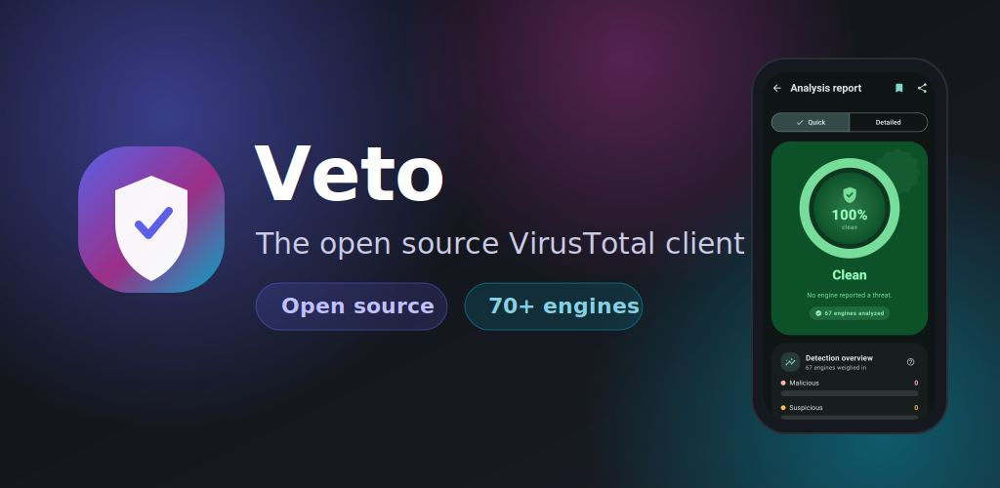
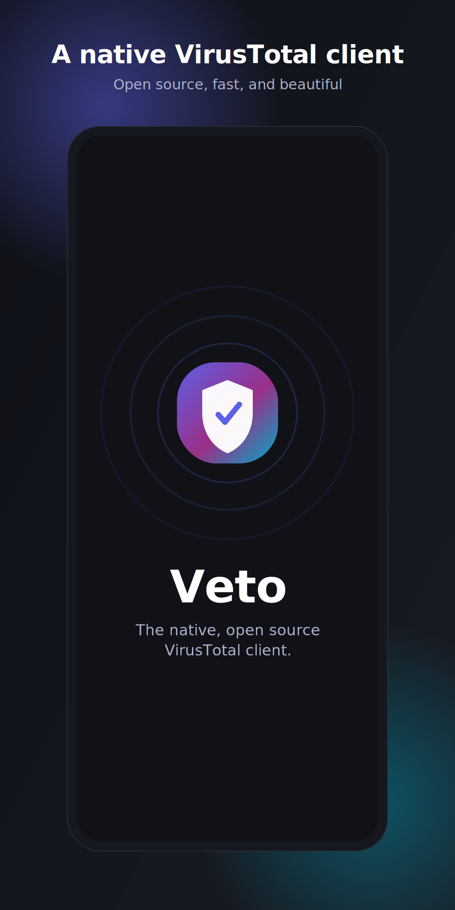
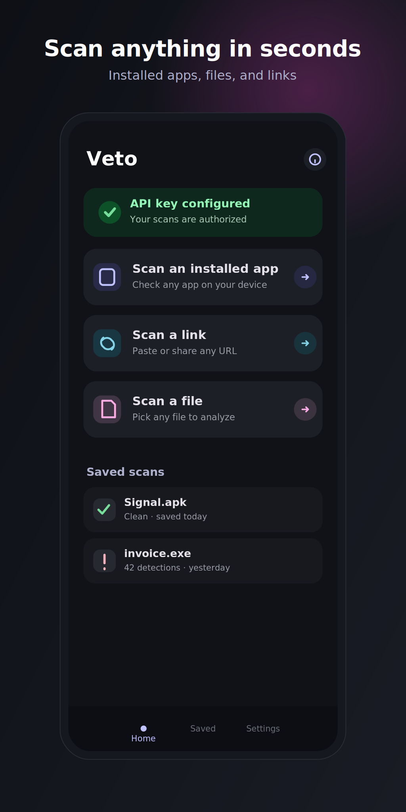
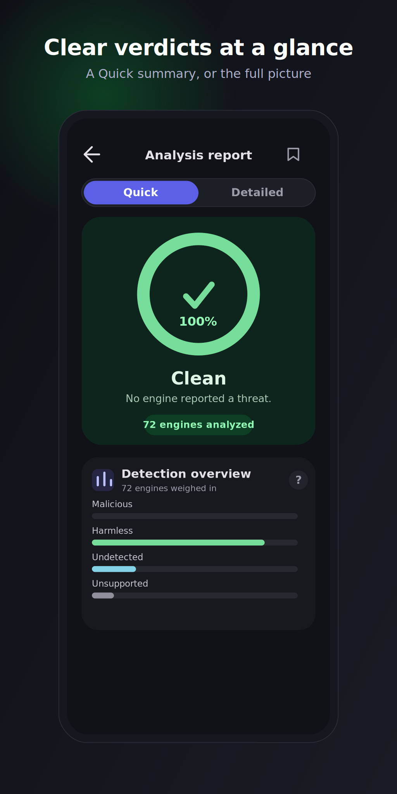
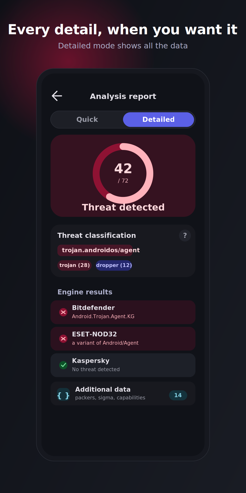
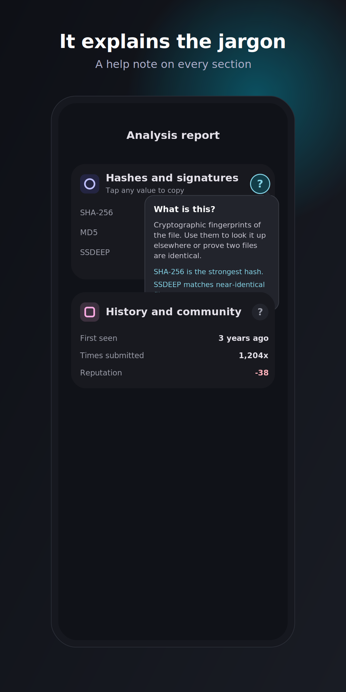

<div align="center">



# Veto

### A sleek, open source VirusTotal client for Android

Free and open source. Bring your own VirusTotal API key and scan files, links and installed apps against more than 70 engines, wrapped in a clean Material 3 interface. No accounts, no tracking, no ads.

[](https://developer.android.com)
[](https://kotlinlang.org)
[](https://developer.android.com/jetpack/compose)
[](https://developer.android.com/tools/releases/platforms)

</div>

## What is Veto?

Veto is a sleek, open source Android client for VirusTotal. Submit a file, a link, or one of your installed apps, watch the analysis happen in real time, and read a clear report that goes from a single verdict all the way down to every field the service returns.

It is free and open source, with no accounts of its own, no tracking, and no advertising. You bring your own free VirusTotal API key, so scans run under your own account and nothing is routed through a third party.

## Screenshots

<div align="center">
<table>
  <tr>
    <td></td>
    <td></td>
    <td></td>
  </tr>
  <tr>
    <td></td>
    <td></td>
    <td></td>
  </tr>
</table>
</div>

## Features

* Scan installed apps, arbitrary files, or any URL
* Aggregated verdict from more than 70 antivirus engines
* Quick mode for an at a glance summary, and a Detailed mode for the complete report
* A short, plain language explanation on every section, which you can switch off in settings
* Full fidelity reports: hashes, threat classification, history and community votes, sandbox behaviour, YARA matches, Android app internals, and an Additional data section that surfaces everything else the service sends back
* Real time upload and analysis progress, with scans that keep running in the background
* Saved reports you can open again later, even offline
* A clear notice when you reach the VirusTotal rate limit
* Material 3 design that follows your system colours, in light and dark themes

## Architecture

Veto follows a layered architecture (UI, Domain, Data) with Hilt dependency injection. A single app scoped `ScanManager` is the source of truth for scan state, so the UI stays in sync whether the app is in the foreground, in the background, or destroyed.

**Highlights**

* Resilient polling. `/analyses/{id}` is polled with a six minute wall clock cap (a rate limit response simply keeps waiting), then the report is re fetched until results are populated, returning a clear failure instead of an empty report.
* Background safe. `ScanState` lives in `ScanManager` and survives Activity destruction. `ScanService` keeps the process alive and posts the ongoing and completion notifications.
* Full fidelity parsing. The typed model captures the common fields, and the complete raw `attributes` JSON is retained via a custom serializer, so the Detailed report can show literally everything the service returns, including fields the model does not know yet.

## Tech stack

* Language: Kotlin
* UI: Jetpack Compose, Material 3 with `material-icons-extended`, a custom expressive theming layer
* Dependency injection: Hilt
* Networking: Retrofit, OkHttp, `kotlinx.serialization`
* Async: Kotlin Coroutines
* Persistence: DataStore for saved scans and settings
* Min and Target SDK: 30 and 36, JDK 17

## Getting started

Prerequisites

* Android Studio, latest stable
* JDK 17
* A free VirusTotal API key from https://www.virustotal.com/gui/my-apikey

Build and run

```bash
git clone https://github.com/ProfessorQuantumUniverse/VTScan.git
cd VTScan
./gradlew :app:assembleDebug
```

Or open the project in Android Studio and press Run.

On first launch the intro screen asks for your VirusTotal API key. Paste it in and you are ready to scan. The key is stored locally on device. The free key allows up to four lookups per minute.

## Project structure

```
app/src/main/java/com/quantum_prof/vtscansuite/
  data/          models, remote API, repository implementation
  domain/        repository interface and use cases
  di/            Hilt modules
  scan/          ScanManager, ScanService, notifications
  ui/
    intro/       animated splash and API key entry
    dashboard/   home, link, file and app scanners, scanning overlay, settings
    results/     full report rendering (Quick and Detailed)
    components/  reusable expressive components
    theme/       color, shapes, typography, motion
    util/        haptics, interactions, linking
```

Store listing assets live in `fastlane/metadata/android/en-US/` (text) and `docs/store/svg/` (editable mockups). See `docs/store/export.html` to render the mockups to PNG.

## Privacy

The app talks only to VirusTotal, using the API key you provide. The items you scan and their results are sent to VirusTotal for analysis. Your API key is stored locally on your device. Veto itself collects no analytics and contains no advertising.

## License

TODO. A license has not been chosen yet, which means default copyright applies and F-Droid cannot accept the app. Pick a FOSS license (for example GPL 3.0 or MIT) and add a `LICENSE` file at the repository root before publishing.

<div align="center">

Powered by the VirusTotal API. Not affiliated with or endorsed by VirusTotal.

</div>
